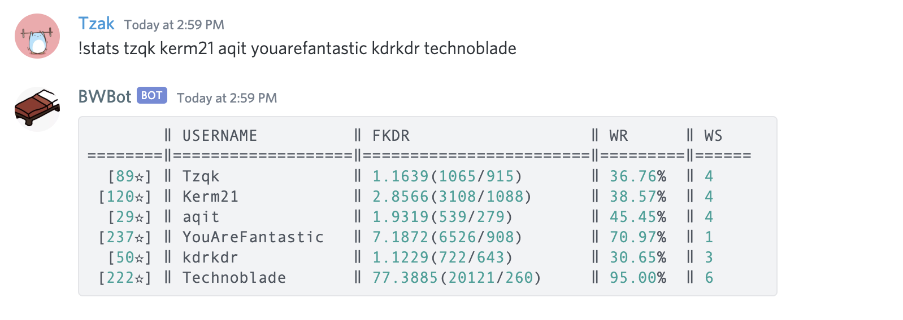

# BWBot
BWBot is a Discord bot written in Python 3 for querying Hypixel Bedwars stats and many other functions.



# Installation
Clone the repository:
```
git clone https://github.com/jacklee1792/BWBot
```
Install required modules
```
pip3 install requirements.txt
```
Follow the [following instructions](https://github.com/reactiflux/discord-irc/wiki/Creating-a-discord-bot-&-getting-a-token) to set up a bot on your Discord server, then create a `.env` file in the directory of `bwbot.py` with the following contents,
```
discord-bot-token = YOUR_BOT_TOKEN
hypixel-api-key = YOUR_API_KEY
```

where `YOUR_BOT_TOKEN` and `YOUR_API_KEY` are your bot token and Hypixel API key, respectively. Install additional dependencies as required by `requirements.txt`.

# Usage

To start the bot:
```
python3 bwbot.py
```

By default, BWBot uses the '!' command prefix. This can be changed by modifying the following line in `bwbot.py`:
```
bot = commands.Bot(command_prefix='!')
```
